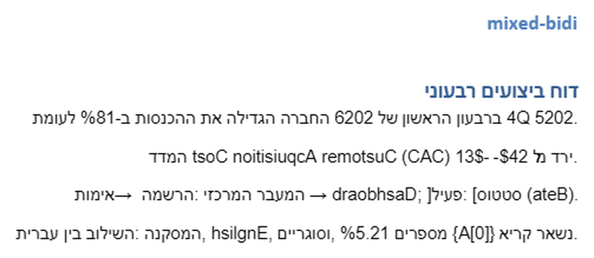
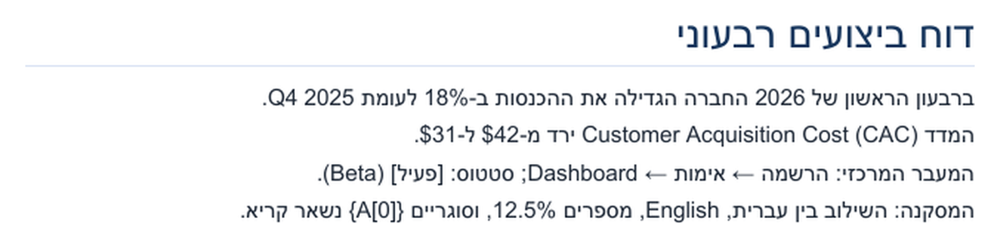
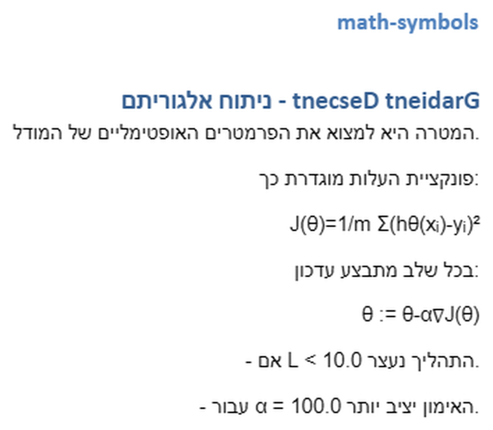
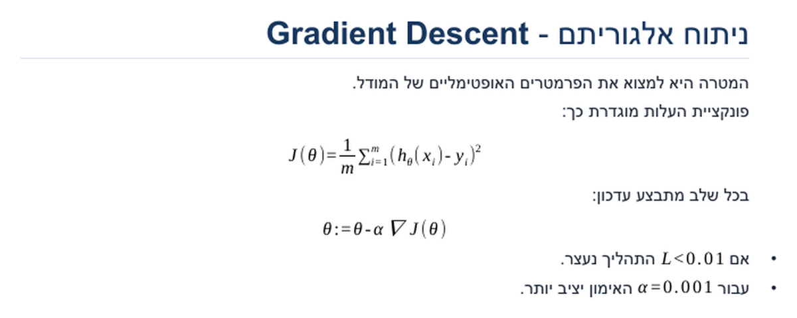
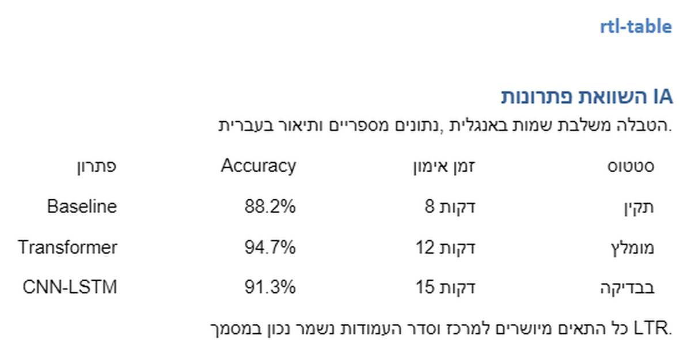
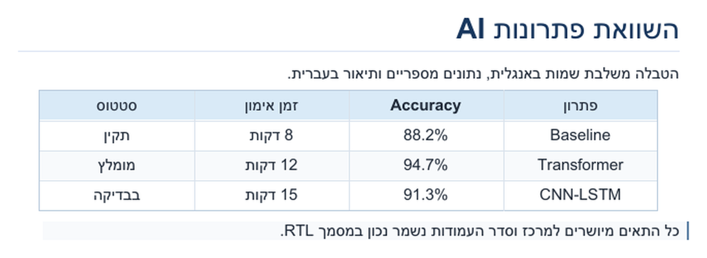
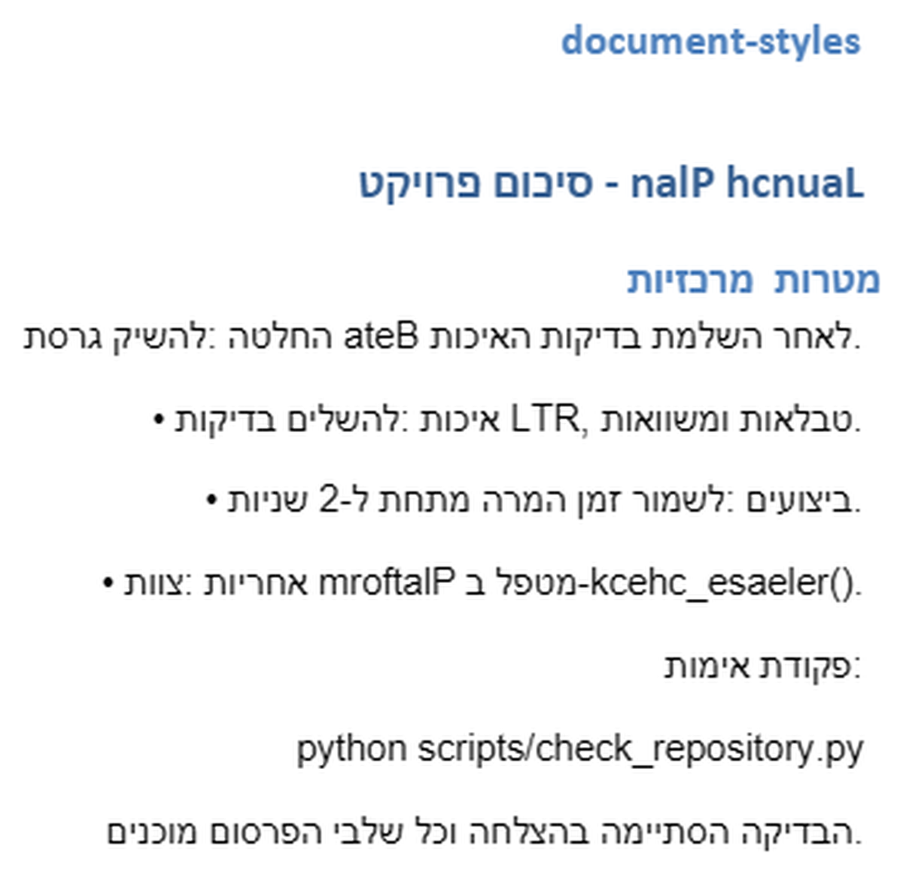
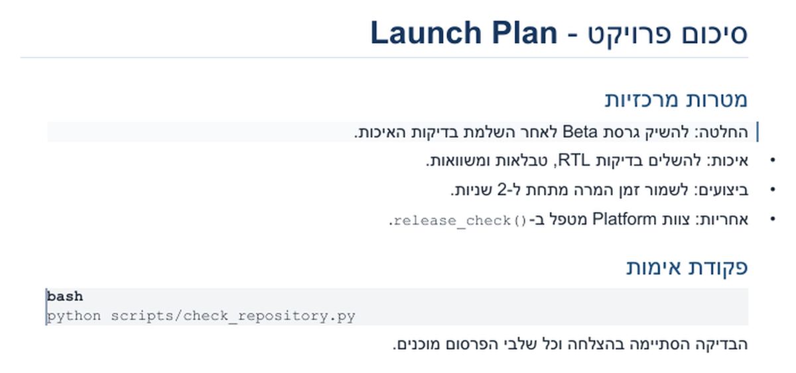

# LLM to Word

Local, self-contained tools that turn LLM output into polished Microsoft Word
documents. The project focuses on native RTL and BiDi behavior, editable OMML
equations, logical RTL tables, centered cells, and stable spacing between
Hebrew or Arabic and English, numbers, code, currency, brackets, and
punctuation.

Document conversion is local and self-contained. It requires no account,
payment, Docker runtime, watermark, or telemetry. Docker is used only for
development and cross-platform release verification.

## Before and after

These examples use the same source content on both sides. The left pages come
from an actual four-page DOCX generated in GPT Web without the shared compiler.
The right pages come from DOCX files generated by the shared
Skill One/Chrome/clipboard engine. The DOCX files are rendered to PDF and then
only the PDF pages are rasterized into the images below; none is a desktop or
application screenshot. The current regression gallery specifically verifies
natural Hebrew brackets such as `[פעיל]`, nested LTR syntax such as `{A[0]}`,
sentence-final punctuation, English-adjacent commas, RTL arrows, equations,
tables, and code.

### 1. Hebrew, English, numbers, punctuation, brackets, and arrows

**Basic GPT DOCX**



**Brain-generated DOCX**



### 2. Native equations and mathematical symbols

**Basic GPT DOCX**



**Brain-generated DOCX**



### 3. RTL tables and logical column order

**Basic GPT DOCX**



**Brain-generated DOCX**



### 4. Headings, lists, quotes, code, and document rhythm

**Basic GPT DOCX**



**Brain-generated DOCX**



Regenerate the gallery with
`python scripts/generate_readme_examples.py --baseline-docx path\to\gpt-web-output.docx --renderer word`,
inspect all eight pages, then rerun with `--approve-visual` to validate the four
correct-output visual receipts. The supplied baseline must be one four-page
DOCX, with pages matching the four examples in order. Without
`--baseline-docx`, the generator preserves the existing real baseline images
and regenerates only the corrected outputs. DOCX-to-PDF uses an invisible
Microsoft Word export on Windows; `--renderer libreoffice` is the
cross-platform fallback. PDF-to-PNG always uses `pdftoppm` as a true PDF
rasterizer. LibreOffice PDF import is deliberately not used because importing a
PDF as editable content can reinterpret BiDi text and create a misleading
image. The visual gate inspects each uncropped full page; the published gallery
copy is cropped to its content so text remains readable on GitHub. Keep
`scripts/generate_readme_examples.py` in the repository: CI and the release
suite syntax-check it, and it is the reproducible source of the gallery.

## Products and release status

Status meanings:

- **Verified**: automated tests and the applicable hands-on or visual benchmark
  pass.
- **Implemented, untested**: code exists, but end-to-end product validation has
  not been completed.

| Product | Status | Delivery | Remaining release work |
|---|---|---|---|
| [Chrome extension](products/chrome-extension/README.md) | Verified | Manifest V3 with bundled WebAssembly | Web Store validation, signing, and publication |
| [Clipboard helper](products/clipboard-helper/README.md) | Verified | Windows installer plus native compiler | Signing and publication |
| [Skill One](products/skill-one/README.md) | Verified | Installable AI skill with machine and all-page visual gates | Provider marketplace publication |
| [Word add-in](products/word-addin/README.md) | Implemented, untested | HTTPS Office task pane with bundled WebAssembly | Hosted deployment, provider tests, Word tests, accessibility, and Microsoft manifest validation |

## Feature matrix

| Capability | Chrome extension | Clipboard helper | Skill One | Word add-in |
|---|:---:|:---:|:---:|:---:|
| Runs without a conversion service | Yes | Yes | Yes | Yes |
| Download a native DOCX | Yes | Temporary internal DOCX | Yes | Inserts into Word |
| Formatted clipboard output | Yes | Yes, Word-native | No | No |
| Capture visible LLM output | Yes | Clipboard input | Agent-provided content | AI chat and Word selection |
| CommonMark, GFM, and LLM Markdown | Yes | Yes | Yes | Yes |
| Native editable OMML equations | Yes | Yes | Yes | Yes |
| RTL paragraphs and mixed BiDi runs | Yes | Yes | Yes | Yes |
| RTL table column behavior | Yes | Yes | Yes | Yes |
| Centered table cells | Yes | Yes | Yes | Yes |
| Deterministic OOXML self-validation | Shared compiler tests | Shared compiler tests | Full machine gate and deterministic replay | Shared compiler tests |
| Mandatory all-page visual gate | Manual release check | Manual release check | Yes | Not yet tested |
| User AI credential required | No | No | No | Only for optional AI chat |

## Chrome extension

The extension captures the latest visible answer from ChatGPT, Claude, Gemini,
Microsoft Copilot, Grok, Perplexity, DeepSeek, or a generic LLM page. Users can
also capture selected page content or paste Markdown manually. Auto-detection
selects the provider dialect without injecting a formatting prompt into the
LLM.

Features include:

- Local Manifest V3 service worker with a packaged Rust/WebAssembly compiler.
- Downloaded DOCX and Word-compatible formatted clipboard output.
- Headings H1 through H6, paragraphs, emphasis, links, images as labels/URLs,
  nested lists, blockquotes, fenced code with arbitrary languages, horizontal
  rules, tables, task lists, footnotes, description lists, highlights,
  underline, subscript, and superscript.
- Inline and block LaTeX converted to OMML in DOCX and Presentation MathML in
  formatted clipboard HTML.
- Word-stable mixed-direction spacing and logical RTL table columns.
- Temporary `activeTab` capture instead of broad LLM host permissions.

Install from source:

1. Open `chrome://extensions`.
2. Enable **Developer mode**.
3. Select **Load unpacked**.
4. Choose `products/chrome-extension`.
5. Pin **md2docx - Markdown to Word**.

See the [Chrome extension guide](products/chrome-extension/README.md) for use
and current acceptance gates.

## Clipboard helper

The Windows helper reads Markdown from the clipboard, runs the same canonical
native Rust compiler, asks Microsoft Word to create native rich clipboard
formats, and leaves the result ready for normal paste.

Features include:

- One-command PowerShell installation under `%LOCALAPPDATA%\Programs\md2docx`.
- Private Python environment with pinned Windows automation dependency.
- Start Menu shortcut and configurable global hotkey, default `Ctrl+Alt+M`.
- Repair/upgrade by rerunning the installer and guarded uninstall support.
- Reuses an existing Word process without closing it; closes only documents and
  processes created by the helper.
- Local temporary files are removed after conversion and shortcut errors are
  shown in a Windows dialog.

Build and install from a source checkout:

```powershell
.\scripts\build_converter_core.ps1
PowerShell -ExecutionPolicy Bypass -File .\products\clipboard-helper\install.ps1
```

The packaged release includes `md2docx-core.exe`, so release users do not need
Rust. Microsoft Word desktop and Python 3.12 or newer are currently required.

## Skill One

Skill One is a provider-neutral AI skill that preserves supplied Markdown or
applies a formatting guide while the model authors new Markdown, then sends it
to the same canonical Rust compiler used by Chrome and clipboard. Its machine
gate runs compiler provenance and self-tests, Markdown preflight, feature and
OOXML checks, extracted-text fidelity, and deterministic replay. A second
mandatory gate requires the exact final DOCX to be rendered to PDF, every PDF
page to be rasterized and inspected, and the resulting hashes and page counts
to pass `visual_gate.py`.

Features include:

- Native RTL run properties and Word-stable mixed Hebrew/English spacing.
- Native OMML inline and block equations with supported LaTeX validation.
- Semantic RTL tables, centered cells, headings, paragraphs, quotes, code,
  links, page breaks, and independent list numbering.
- Windows x64 and Linux x64 native builds of the shared core.
- Shared normalization of Hebrew prefixes, em dashes, and Unicode BiDi controls.
- Self-validation of ZIP parts, XML, prohibited output, and core identity.
- Mandatory all-page PDF-image visual review with a machine-checked visual
  receipt. Desktop and application-window screenshots are forbidden.

Package or run it directly:

```powershell
python products\skill-one\package_skill.py
python products\skill-one\skill-one\scripts\docx_brain.py doctor --json
python products\skill-one\skill-one\scripts\docx_brain.py preflight input.md --source llm --json
python products\skill-one\skill-one\scripts\docx_brain.py build input.md output.docx --source llm --report report.json --review-text extracted.txt
python products\skill-one\skill-one\scripts\docx_brain.py review input.md output.docx --source llm --report verify.json --review-text extracted.txt
python products\skill-one\skill-one\scripts\visual_gate.py --docx output.docx --pdf output.pdf --pages-dir rendered-pages --report visual-report.json
```

See [installation](products/skill-one/INSTALL.md), the
[implementation plan](products/skill-one/PLAN.md), and the
[Markdown design guide](products/skill-one/skill-one/references/document-design.md).

## Word add-in

The Office task pane provides an AI chat that can read the current Word
selection on request and return insert, replace-selection, or conversational
reply actions. Its formatting contract asks the provider for structured
Markdown, while the bundled local renderer owns Word formatting.

Implemented features include:

- OpenAI, Anthropic, and Gemini direct-provider adapters for personal testing.
- Session-only API key handling; keys are not written to local storage.
- Selection preview, conversation history, generated Markdown review, insert,
  and replace-selection actions.
- Local WebAssembly conversion with the packaged JavaScript compatibility
  renderer as fallback.
- Native Word insertion through `insertFileFromBase64`.

The add-in has not yet been tested end to end. It still needs an HTTPS
deployment, real provider tests, Word desktop and Word Online tests,
accessibility review, and Microsoft manifest validation. Its direct
browser-key mode is intended only for personal testing.

## Canonical compiler

`shared/rust/md2docx-core/` owns Markdown parsing, source-profile selection,
DOCX generation, clipboard HTML, OMML math, RTL tables, mixed-direction
spacing, styling, and OOXML packaging for all four products.

Build native Windows and browser outputs:

```powershell
.\scripts\build_converter_core.ps1
```

The WebAssembly files are written to `products/chrome-extension/core/`. The
native executable is written to the ignored `dist/windows/` directory.

## Build release packages

Create all four product bundles and a SHA-256 checksum manifest:

```powershell
.\scripts\package_release.ps1
```

Output is written to the ignored `dist/releases/` directory:

- `chrome-extension.zip`
- `clipboard-helper-windows-x64.zip`
- `skill-one.zip`
- `word-addin-host.zip`
- `SHA256SUMS.txt`

The Word add-in archive is a hosting bundle, not a Microsoft-validated store
package. Replace the example HTTPS origin in `manifest.xml` before deployment.

## Verification

Development requirements are Python 3.12, Node.js 22, a stable Rust toolchain,
the `wasm32-unknown-unknown` target, and Docker for the optional clean Skill One
gate. Gallery regeneration additionally requires Microsoft Word or LibreOffice
for DOCX-to-PDF conversion and `pdftoppm` from Poppler or MiKTeX for faithful
PDF-page rasterization.

```powershell
python -m pip install -r requirements-dev.txt
.\scripts\test_all.ps1
.\scripts\test_all.ps1 -IncludeDocker
python scripts\check_repository.py
```

The suite runs Rust unit and conformance tests, rebuilds native and WebAssembly
outputs, runs browser/worker/capture tests, validates JavaScript syntax, runs
Skill One machine and visual-receipt tests, audits publication structure and
documentation, and optionally verifies Skill One in a clean Python container.

For visual review, convert a generated DOCX to PDF and rasterize only the PDF
pages into images. Never capture the desktop or an application window. A human
release tester must separately open release candidates in Microsoft Word and
check Hebrew headings, mixed BiDi text, equations, blockquotes, lists, tables,
and clipboard paste behavior.

## Repository layout

```text
products/
  chrome-extension/  Manifest V3 extension and packaged WebAssembly
  clipboard-helper/  Windows installer and Word-native clipboard helper
  skill-one/          Verified AI skill, package builder, and visual gate
  word-addin/         Implemented but untested Word AI task-pane add-in
shared/
  rust/md2docx-core/  Canonical Markdown compiler shared by all four products
tests/                Cross-product conformance and regression suites
scripts/              Build, gallery regeneration, verification, and packaging
docs/                 Formatting contract and product roadmap
```

## Production checklist

- [x] Local-only canonical conversion architecture.
- [x] Organized product and shared-core repository structure.
- [x] Locked Rust and development Python dependencies.
- [x] Automated Rust, WebAssembly, browser, Skill One, and Docker gates.
- [x] Credential-literal scanning in CI.
- [x] Deterministic release packaging with SHA-256 checksums.
- [x] Privacy, security, contribution, licensing, and third-party notices.
- [x] Chrome extension hands-on conversion and clipboard use.
- [x] Clipboard helper hands-on installation, shortcut, and Word paste use.
- [x] Skill One machine validation and mandatory all-page visual workflow.
- [ ] Chrome Web Store validation and signed publication.
- [ ] Clipboard helper signing and publication.
- [ ] Word add-in hosted, provider, Microsoft Word, and manifest validation.
- [ ] Signed native Windows release artifacts.

See the live [product roadmap](docs/ROADMAP.md) for the remaining external
release gates.

## License and policies

MIT licensed. See [third-party notices](THIRD_PARTY_NOTICES.md),
[privacy](PRIVACY.md), [security](SECURITY.md), and
[contributing](CONTRIBUTING.md).
